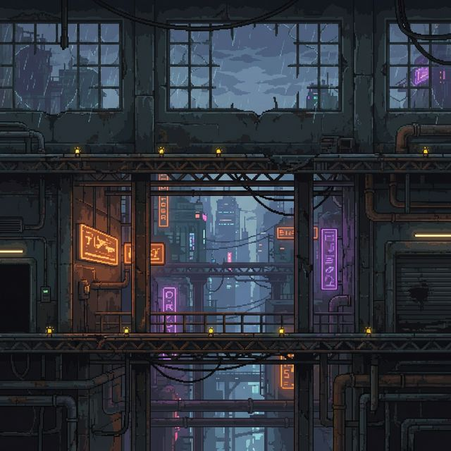

# 🎮 Galactic Defender

**Galactic Defender** is a visually impressive, level-based 2D side-scrolling arcade shooting game built in Java using Swing/AWT. Set in a gritty industrial cyberpunk environment, the game challenges players to navigate platforms, jump, and shoot through waves of enemies to reach the final boss.



## 📌 Project Overview
This project demonstrates advanced Object-Oriented Programming (OOP) principles and follows a structured "game engine-like" architecture. It runs at a smooth 60 FPS using a dedicated game loop thread and active rendering.

## 🎯 Gameplay Features
- **Player System**: Move, jump, and shoot with smooth animations.
- **Level System**: Progression from Level 1 to 3 with increasing difficulty.
- **Enemy System**: A variety of enemies with unique AI patterns:
  - **BasicEnemy**: Slow-moving tactical soldiers.
  - **FastEnemy**: Agile enemies with zigzagging movement.
  - **BossEnemy**: A heavily armored, high-HP boss at Level 3.
- **Power-Ups**: Collectible orbs for Double Bullets, Invincibility Shields, and Speed Boosts.
- **High Score System**: Automatic high score persistence to `highscore.txt`.

## 🏗 OOP Implementation
The game is built from the ground up to showcase core OOPS concepts:
- **Encapsulation**: Private fields with controlled accessors for entity states (health, score, velocity).
- **Inheritance**: A hierarchy starting from an abstract `GameObject` base class.
- **Polymorphism**: Universal updates and rendering through a list of `GameObject` instances.
- **Interfaces**: Contracts for interactions (e.g., `Collidable`, `Drawable`).
- **Abstraction**: Abstract classes for `Enemy` and `PowerUp` to enforce shared behavior while allowing unique implementations.

## 🧵 Multithreading & Architecture
- **Game Engine**: Orchestrates all subsystems.
- **Game Loop**: A dedicated `Thread` running at 60 FPS with fixed-timestep logic.
- **Managers**: Dedicated managers for Collisions, Levels, Spawning, Scoring, and Scenes.
- **Safe Iteration**: Uses `CopyOnWriteArrayList` to ensure safe object removal during the game loop.

## 🛠 Tech Stack
- **Language**: Java 8+
- **Rendering**: Java Swing & AWT (Graphics2D)
- **Persistence**: Java File I/O
- **Build**: Batch/PowerShell scripting

## 🚀 Getting Started

### Prerequisites
- Java Development Kit (JDK) 8 or higher installed and added to your PATH.

### Installation
1. Clone the repository:
   ```bash
   git clone https://github.com/heisenbuRg-Shinde/galactic_defender.git
   cd galactic_defender
   ```

2. Run the game using the provided build script:
   ```powershell
   .\build.bat
   ```

### Controls
| Action | Key |
| :--- | :--- |
| **Move** | Arrow Keys (← / →) |
| **Jump** | Arrow Key (↑) |
| **Shoot** | Spacebar |
| **Pause** | P |
| **Restart** | R (on Game Over screen) |
| **Quit** | ESC |

## 📂 Package Structure
- `com.galacticdefender.engine`: Game Loop, Window, and Resource Loading.
- `com.galacticdefender.objects`: Player, Enemies, Bullets, and Platforms.
- `com.galacticdefender.managers`: Collision, Level, Spawn, and Score logic.
- `com.galacticdefender.ui`: All game screens (HUD, Start, Pause, Game Over).
- `com.galacticdefender.utils`: Constants, Interfaces, and World data.

---
Built as an OOPS project demonstration. 🚀